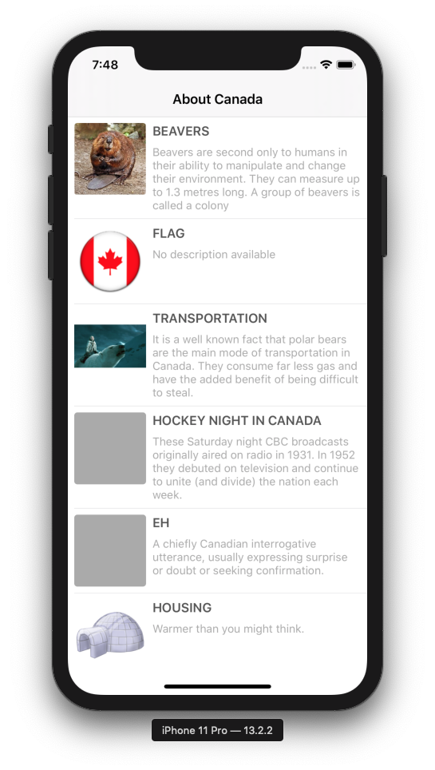

# DataFeed Demo Project

A simple app that fetches JSON and displays the results and images in a tableview.

## Instructions
Open `DataFeed.xcodeproj` in Xcode 11

To run the application, `Build & Run` on the desired iPhone and iPad simulator (cmd+R)

To execute all unit tests, `Build & Test` on the desired device (cmd+U)

## Functionality
* MVVM Architecture
* Supports iOS 11.0+
* Supports Xcode 11
* Supports iPhone and iPad
* Supports portrait and landscape orientation
* Supports dark mode (iOS 13.0+ only)
* Pull to refresh
* Unit testing
* No third-party dependencies
* Decodable JSON parsing
* xcconfig configuration
* URLSession based networking
* Dynamic height tableview cells
* Programmatic auto layout, no storyboards or xibs
* Async image downloading
* Error handling

## Author
**Daniel Bowden**

www.github.com/danielbowden

www.twitter.com/danielgbowden

www.danielbowden.com.au

